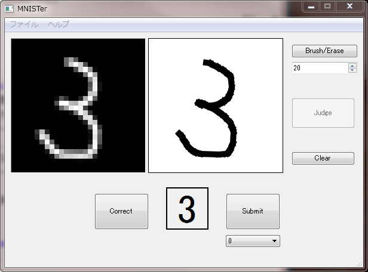

MNISTer
====

# Description
マウスによる手書き数字を 28 x 28 の画像データとして自動保存してくれるアプリケーションです。  
また同時にニューラルネットワークによる推論を行い、手書き数字が何なのかを返してくれます。  
今のところ簡単な畳込みニューラルネットワークと、MNIST データセットによる訓練済みパラメータ（テスト精度 90% 以上）が実装されています。  

# Requirement
- Python 2.7.x
- numpy
- PyQt4
- Pillow (PIL)

# Usage
## アプリの起動  
`$ python mnister.py`

## アプリに手書き数字を予測させる
- 右の四角に数字を描く
- Judge ボタンを押す
- 左の四角にダウンサンプリングされた画像（28 x 28）が表示される
- 下の四角に予測結果が表示される

## 手書きした数字のダウンサンプリング後の画像を保存する
- 予測結果が合っていれば Correct ボタンを押す
- 間違っていれば正しい結果をコンボボックスから選択し、Submit ボタンを押す
- ダウンサンプリングされた画像が images/ 以下の各数字用のディレクトリに保存される

## 予測に使うモデルとパラメータファイルを選択する
- メニューバー →「ファイル」→「モデル選択」をクリックする
- 上のコンボボックスからモデルを選択する
- 下のコンボボックスからパラメータファイルを選択する

# Install
以下のコマンドで任意のディレクトリに clone してください。  
`$ git clone git@github.com:matsu490/MNISTer.git`  
または任意のディレクトリに ZIP ファイルをダウンロードして解凍してください。

# References
1. [Painting on a Widget](https://www.codeproject.com/Articles/373463/Painting-on-a-Widget "Qt での手書き文字入力")
2. [『ゼロから作る Deep Learning』のリポジトリ](https://github.com/oreilly-japan/deep-learning-from-scratch)

# Licence
Copyright (c) 2017 matsu490  
Released under the MIT license  
https://github.com/matsu490/MNISTer/blob/master/LICENSE.txt  

# Author
[matsu490](https://github.com/matsu490)
