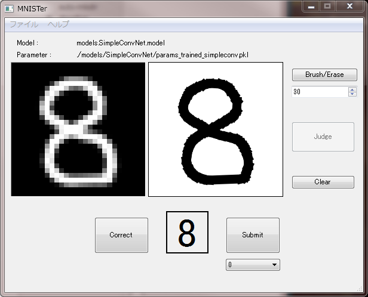

MNISTer
====

# Description
マウスによる手書き数字を 28 x 28 の画像データとして自動保存してくれるアプリケーションです。  
また同時にニューラルネットワークによる推論を行い、手書き数字が何なのかを返してくれます。  
今のところ簡単な畳込みニューラルネットワークと、MNIST データセットによる訓練済みパラメータ（テスト精度 90% 以上）が実装されています。  

# Requirement
- Python 2.7.x
- numpy
- PyQt4
- Pillow (PIL)

# Usage
## アプリの起動  
`$ python mnister.py`

## アプリの使い方
- 右の四角に数字を描く
- Judge ボタンを押す
- 左の四角にダウンサンプリングされた画像（28 x 28）が表示される
- 下の四角に推論結果が表示される
- 推論結果が合っていれば Correct ボタンを押す
- 間違っていれば正しい結果をコンボボックスから選択し、 Submit ボタンを押す
- ダウンサンプリングされた画像が保存される

# Install
任意のディレクトリに clone してください。

# ToDo
- [ ] 手書き入力と同時に訓練もできるようにする
- [x] ネットワークと学習用パラメータファイルの選択を可能にする
- [ ] 現在の正答率を表示する
- [x] 起動時に画像保存用フォルダを自動で作成する

# References
1. [Painting on a Widget](https://www.codeproject.com/Articles/373463/Painting-on-a-Widget "Qt での手書き文字入力")
2. [『ゼロから作る Deep Learning』のリポジトリ](https://github.com/oreilly-japan/deep-learning-from-scratch)

# Licence
Copyright (c) 2017 matsu490  
Released under the MIT license  
https://github.com/matsu490/MNISTer/blob/master/LICENSE.txt  

# Author
[matsu490](https://github.com/matsu490)
